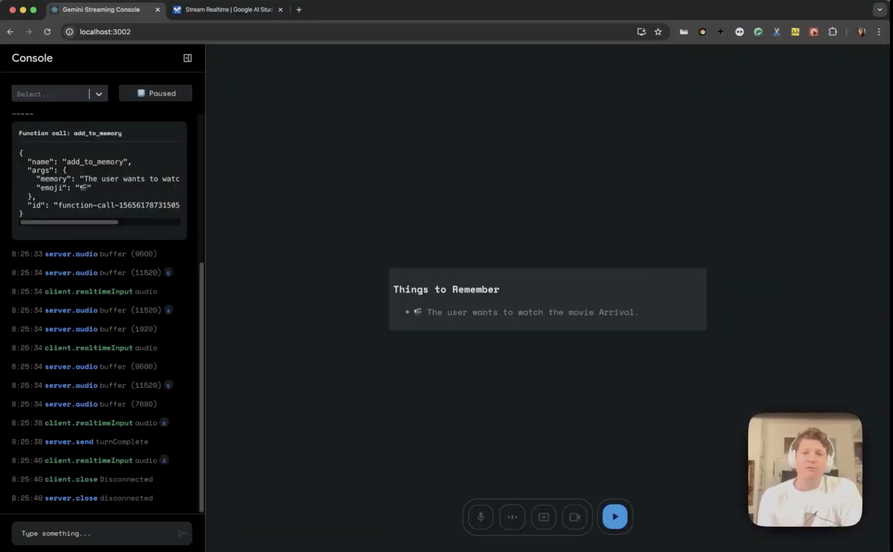

# AudioPay: AI Navigation Assistant for Blind and Visually Impaired Users

AudioPay is an open-source, AI-powered assistive tool that works like smart glasses.
It captures live visual context (webcam or screen), sends it to Google Gemini Live API, and returns spoken narration to help users understand surroundings in real time.

[](https://www.youtube.com/watch?v=J_q7JY1XxFE)

## Why this project matters

This project is focused on accessibility-first interaction.
Instead of requiring constant manual querying, it supports proactive narration that can help users with situational awareness and navigation context.

## What it does

It captures visual input, streams or batches frame context, and receives spoken AI narration describing what is visible.

Core idea:
- Help blind and low-vision users “see” through audio descriptions.
- Keep interaction available both as user-driven Q&A and autonomous narration.

## Two core modes

- Passive mode
  - User types a question.
  - Model responds using current visual/audio context.

- Active mode
  - Autonomous loop.
  - Continuously captures recent visual context and proactively narrates.
  - No repeated user prompting required.

## Key pipeline

```text
Camera/Screen -> ControlTray (capture + rolling frame buffer)
                      -> ActiveNarrationManager (loop pacing via turncomplete)
                      -> GenAILiveClient (Gemini Live transport)
                      -> Audio Streamer -> Speaker
```

## What makes it useful for assistive narration

- Rolling frame window
  - Active mode sends a recent sequence of keyframes (oldest to newest), not just one snapshot.
  - This gives temporal context so the model can detect movement and changes.

- Tunable performance controls
  - Capture FPS and frame-window size are configurable.
  - You can tune for responsiveness vs bandwidth/compute cost.

- Turn-safe pacing
  - Active loop waits for `turncomplete` before next cycle.
  - Prevents overlapping narration and request pile-up.

## Open source goals

This repository is intended to be an open collaborative base for real-world assistive AI.
Contributions are welcome for reliability, accessibility UX, safety behavior, multilingual support, and device integration.

## Getting started

1. Create a Gemini API key: https://aistudio.google.com/apikey
2. Add to `.env`:

```env
REACT_APP_GEMINI_API_KEY=your_key_here
```

3. Install and run:

```bash
npm install
npm start
```

Open `http://localhost:3000`.

## Configuration in Active mode

Current controls in UI:
- Interval (ms): narration cycle delay after each completed response.
- Capture FPS: how frequently frames are captured.
- Window (ms): size of recent visual history used to pick keyframes.
- Require webcam/screen stream: whether active loop should run only with visual input.

## Project structure

A detailed architecture and file map is documented in:
- [structure.md](./structure.md)

## Contributing

- Check `CONTRIBUTING.md` for contribution expectations.
- Keep changes accessibility-oriented and test with both passive and active modes.
- Prefer small PRs with clear behavior notes.

Suggested contribution areas:
- Navigation-specific prompts and safety heuristics.
- Better uncertainty/fallback handling when vision is unclear.
- Low-latency optimizations for edge/mobile devices.
- Language support and voice UX improvements.
- Benchmarks and eval harness for assistive quality.

## Available scripts

- `npm start`: run in development.
- `npm run build`: production build.

## License

Licensed under Apache 2.0. See [LICENSE](./LICENSE).

## Notes

This is an experimental project built on Gemini Live APIs and is not a medical device.
Always treat model outputs as assistive guidance, not guaranteed truth.
